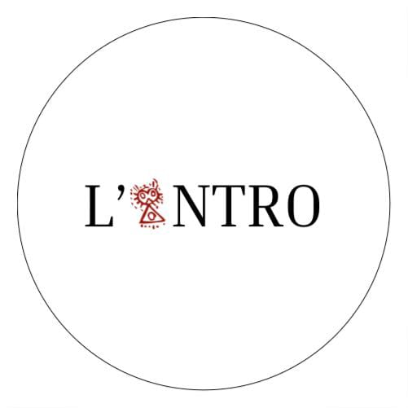

<!-- Intro  -->
<h3 align="center">
        <samp>&gt; Hey There! I am
                <b>Gustavo</b>
        </samp>
</h3>

# Sobre mim

 
    <strong>Engenheiro de Dados | Estudante de Sistemas de Informação  na UFPA</strong> - Castanhal, Pará, Brasil  

<blockquote>
  

    Engenheiro de Dados com 7 meses desenvolvendo pipelines e análises com <strong>Python</strong>, <strong>SQL</strong>, <strong>Docker</strong> e <strong>AWS</strong>. Também estudo <strong>PySpark</strong> e <strong>Airflow</strong> para otimizar processamento de dados e pipelines de ETL.
  

</blockquote>

### Meus Contatos

  
  
  

## Experiências

Na visão geral abaixo você encontrará minha experiência de trabalho mais recente:

**Data Engineer AWS** \
[**Compass UOL**](https://compass.uol/en/home/) • Part-time remoto \
Linguagens & Tecnologias: `SQL`, `PostegreSQL`, `Python`, `AWS`, `Docker`, `Spark`\
Projetos em destaque: [Data Lake AWS](https://github.com/gustavon10/Data-Lake-AWS)
 

**Engenheiro de Dados** \
[**LinkJr**](https://linkjr.com.br/) • Part-time remoto \
Linguagens & Tecnologias: `PostgreSQL`, `Docker`, `Node`, `JavaScript`\
Projetos em destaque: [Castanhal Online](https://castanhalonline.com/), [ChatBot](https://github.com/linkjr-castanhal/chatbot-whatsapp)
 

**Analista de Dados** \
[**L'antro**](https://ppgeaa.propesp.ufpa.br/index.php/br/programa/noticias/todas/449-relatorio-de-estudos-antropicos-rea-do-municipio-de-castanhal) • Part-time hibrido \
Linguagens & Tecnologias: `Excel`, `SQL`, `Python`, `Docker`\
Projetos em destaque: [Residuos](https://github.com/gustavon10/residuos-castanhal)
 
 

Por favor, encontre-me no [LinkedIn](https://www.linkedin.com/in/gustavo-nunes-data-engineer/) para uma descrição mais detalhada da minha experiência de trabalho, educação e certificação.

## Certificados

 
 
 
 

  ## Idiomas
>### **Português 🇧🇷**
>Nativo

>### **Inglês 🇺🇸**
>Intermediário 

  